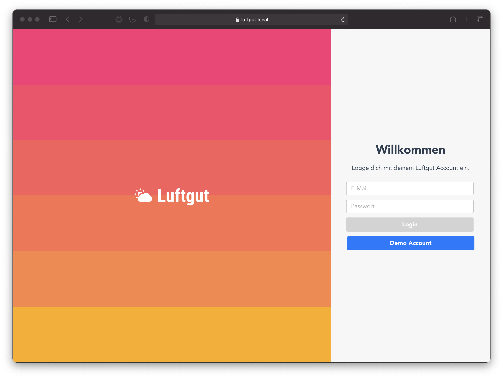
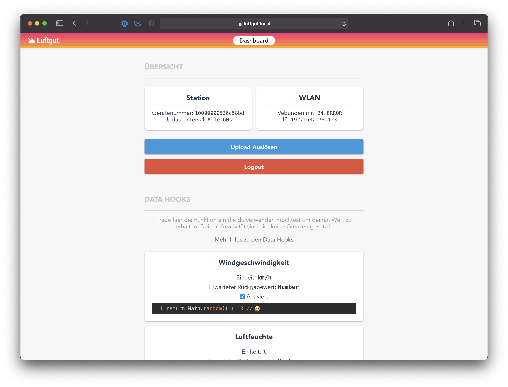
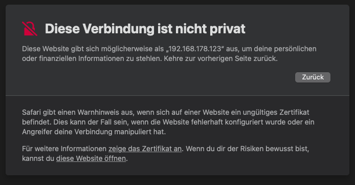

# luftgut-core

<div style="display: flex; width: 100%;">
  
  
</div>

## Tech Stack

Für den Core der Station kahmen folgende Technologien zum Einsatz:

- `Balena` - Fleet Management
- `NodeJS` - "Programmiersprache / Umgebung"
- `Firebase` - Nutzerverwaltung, Datenspeicher
- `Express` - Server
- `Socket.io` - Kommunikation zwischen Backend und Frontend
- `VueJS` - Frontend
- `LowDB` - Zur lokalen Speicherung des Logins und der Data Hooks

## Setup

Um den Nutzer und seine Daten zu schützen ist eine Verbindung mit dem Webserver ausschließlich über eine `https` Verbindung möglich. Für die Verwendung des https Protokolles ist es notwendig zuvor ein SSL Zertifikat zu generieren.

```shell
cd src/server/ssl
openssl genrsa -out key.pem
openssl req -new -key key.pem -out csr.pem
openssl x509 -req -days 9999 -in csr.pem -signkey key.pem -out cert.pem
rm csr.pem
```

Da es sich um ein "Self Signed" Zertifikat handelt wird der Browser vor dem Verbinden mit dieser Webseite warnen. Solange niemand zu dem Raspberry Pi und dem darauf gespeicherten Schlüsselpaar zugang hat, hat der Nutzer hier nichts zu befürchten.



## NPM Scripts

```shell
sudo npm run <command>
```

`start` (benötigt Superuser Rechte)<br>
Startet die Anwendung aus dem `build` Ordner. Damit dies funktioniert muss die Anwendung vorher kompiliert worden sein `npm run buid`.

`build`<br>
Kompiliert die Anwendung und erzeugt den Ordner `build` in welchem der kompilierte NodeJS Code gespeichert wird.

`lint`<br>
Dies führt ESLint aus und weißt auf eventuelle Programmierfehler hin.

`dev` (benötigt Superuser Rechte)<br>
Führt die Datei aus und achtet auf Änderungen an dem `src` Verzeichnis.

`dev:lint`<br>
Führt bei jeder Änderung zunächst den `lint` Befehl aus.

## Socket.io Verbindung testen

Ist CORS ([Cross-Origin Ressource Sharing](https://en.wikipedia.org/wiki/Cross-origin_resource_sharing)) aktiviert kann eine Vebindung zum Socket.io Server von jeder beliebigen Webaddresse hergestellet werden. `src/server/websocket/index.ts`

Socket.io Tester: https://hoppscotch.io/de/realtime/<br>
Addresse: `wss://<IP-Addresse>`<br>
Pfad: `/socket.io` (Standard)

## Bottlenecks

- Zurzeit müssen Libraries die man in einer Hook verwenden möchte zuvor vía `npm` installiert werden.
- Fällt eine Data Hook aus, da sie beim Ausführen ein Fehler auftritt werden die restlichen Daten nicht weiter hochgeladen.
